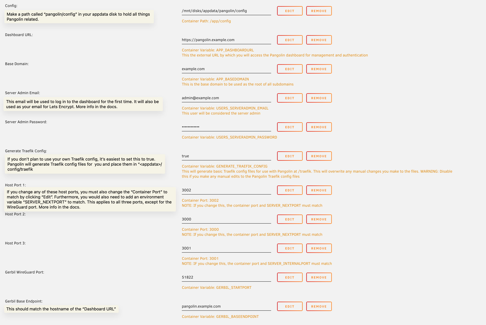
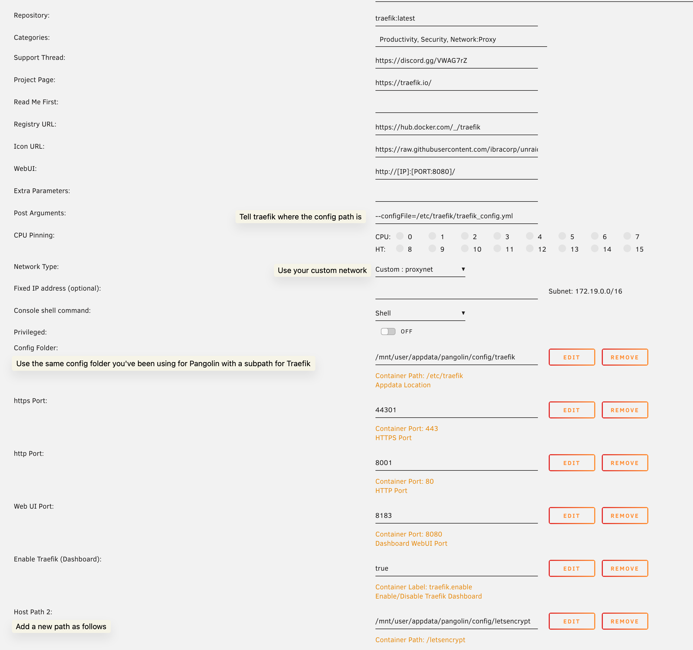
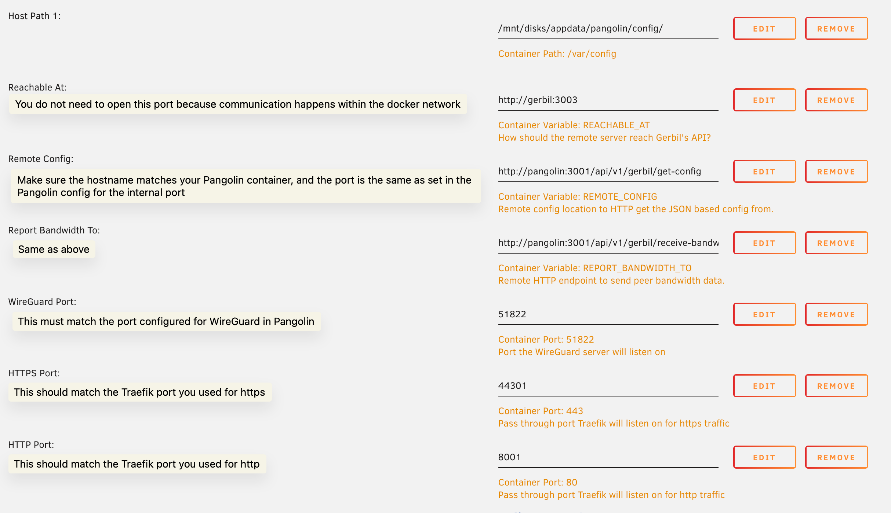

# Unraid

:::warning

Installing Pangolin, Gerbil, and Traefik on Unraid assumes you are able to port forward on the network running these servers. If you're behind CGNAT, install Pangolin a VPS and install Newt on your Unraid server to bypass the port forwarding restriction.

**If you just want to install Newt on Unraid, and have no interest in running Pangolin and its components, there is a Newt container available in the Community Apps store. See the Newt install instructions for Unraid [here](https://docs.fossorial.io/Newt/install#unraid).**

:::

:::note

You can use an existing Traefik installation should you have one, but it will require more manual/custom configuration. This guide will focus on setting up Traefik from scratch to work with our system, but you're free to modify the Traefik configuration as much as you'd like.

:::

The first part of this tutorial will explain how to use Pangolin and Traefik as a local reverse proxy without Gerbil and its tunneling features. The second (optional) part will expand on this and show how to enable tunneling by setting up Gerbil.

All containers are available in the Unraid Community Apps (CA) store. If you're not familiar with Unraid, you can find more information on their [website](https://unraid.net/).

This installation has a lot of moving parts and is a bit non-standard for Unraid because Pangolin and its components were designed to run as micro-services on a VPS in tunneling mode. However, some may want to use "Local" reverse proxying on their Unraid server or use their Unraid server as a tunnel controller with Gerbil. For either of these use cases, follow the steps outlined in this guide.

## Video Tutorial

If you prefer a video tutorial for this guide, you can find it [here](https://youtu.be/F3w1Ur175zI).

## Prerequisites

- A working Unraid server.
- A domain name with access to configure DNS and the ability to port forward on your network.
  - The networking is the same as for the VPS, just on your local network, so please refer to [Networking page](https://docs.fossorial.io/Getting%20Started/dns-networking) for more info.

## Create a Docker Network

Before starting, create a new docker network on Unraid. This will simplify things, and allow the containers to communicate with each other via their container names. If you already have a network, there is no need to create another one. 

1. Open the web terminal in Unraid
2. Run the following command:

_You can use any name you want for the network. We will use `mynetwork` in this guide._

```bash
docker network create mynetwork
```

For more info on this, see this [tutorial by IBRACORP](https://www.youtube.com/watch?v=7fzBDCI8O2w).

## 1. Setup Pangolin and Traefik

This first part will enable Pangolin to work in "Local" reverse proxy mode. Newt and WireGuard will **not** be able to be used after finishing this first part. However, if you want to use those features, you still need to follow this first part of the tutorial because we show how to set up Pangolin and Traefik first.

### Install and Setup Pangolin

#### 1. Install Pangolin via the CA Store

#### 2. Configure Pangolin

Set the network to the one you created earlier.

:::note

Pangolin environment variables will take precedence over the values in the `config.yml` file. If you set an environment variable, it will override the value in the `config.yml` file. This is useful for setting secrets and other sensitive information.

:::

<p align="center">
    
</p>

Some important considerations:

Server Admin Email:

The server admin email is mainly used to set up the first "Server Admin" account which you will use to log in for the first time. If you allow Pangolin to generate the Traefik config for you, this will also be used as the Let's Encrypt admin email for certs. If you wish to use a different email for Let's Encrypt, you would need to manually edit the Traefik config file after it's been created. For the vast majority of people, it is perfectly fine to use the same email for both.

Generate Traefik Config:

This is primarily here for your convenience. Setting this to `true` will have Pangolin generate the Traefik files for you and insert the needed info based on the other Pangolin config settings. Traefik files will be placed in `<appdata>/config/traefik`. On each container restart, these files will be overwritten by Pangolin. Thus, if you edit the Traefik files manually, you should set this to `false`. It's best to keep this enabled on first start to generate the files for you to edit later.

If you're using a different Traefik config other than the one provided by Pangolin, it is okay to leave this enabled. It will not overwrite your config unless your config is in the `<appdata>/config/traefik` path which it unlikely is.

Ports:

Due to the way Pangolin was designed to work with docker compose and a config file, the way it handles ports is a little different as compared to other popular Unraid containers. For all host ports:

The host ports, container ports, and ports in the config should match for simplicity. This is because the Pangolin config also has ports in it. If you decide to use a non-default port, you would need to add the matching environment variable or edit the `config.yml` file to match. For example:

If I wanted to change Host Port 1, I would do the following:

- Click edit on the port
- Set the "Container Port" to the new port you want to use
- Set the "Host Port" to the new port you want to use
- Add a new environment variable with key `SERVER_NEXTPORT` and value as the new port you want to use

This does not apply to the WireGuard port.

Any Gerbil Config:

You can leave these here even if you don't plan to use Gerbil.

Gerbil Base Endpoint:

This should match the Dashboard Url field.

#### 3. Save the config and start the Pangolin container.

Upon starting, Pangolin will create the needed files in the appdata path. You can access the dashboard WebUI by the "Host Port 1" port on your Unraid machine.

#### 4. Log in to the dashboard

Log in with the admin email and password you set in the config. Follow the setup steps.

- Create your first Organization
- Create your first "Local" site for local reverse proxying

### Install and Setup Traefik

Before starting with Traefik, shut down the Pangolin container.

#### 1. Install Traefik via the CA Store

This section will use the Traefik template from the "IBRACORP" repository. If you already have a Traefik installation running, you should manually configure your Traefik config to work with Pangolin. Take a look at the Traefik files in the Docker Compose guide to see what to add to your config.

<p align="center">
    
</p>

#### 2. Configure Traefik

<p align="center">
    
</p>

_Please refer to the official Traefik docs for more information on the Traefik configuration beyond this guide._

**Match your config to the one above. You will have to remove some of the default variables in the template that are not needed. You can always add them back if you need them later.**

Network Type:

Set the network type to the one you created earlier.

Post Arguments:

Tell Traefik where the config file is located by adding the following to the "Post Arguments" field:

```bash
--configFile=/etc/traefik/traefik_config.yml
```

Config Folder:

If you're using the Traefik config generated by Pangolin, point this to the same appdata path as Pangolin, but append `/traefik`, like this: `<appdata>/config/traefik`.

Lets Encrypt (Host Path 2 in screenshot):

Traefik will store the certification information here. You can make this path anywhere you want. For simplicity, we're placing it in the same config path at `<appdata>/config/letsencrypt`.

Ports:

You will need to port forward the https and http ports listed in the config on your network's router.

## 2. Add Gerbil for Tunneling (Optional)

:::note

If you do not want to use the tunneling feature of Pangolin and only want to use it as a local reverse proxy, you can stop here.

:::

Before setting up Gerbil, shut down Traefik and Pangolin.

If you plan to use tunneling features of Pangolin with Newt or WireGuard, you will need to add Gerbil to the stack. Gerbil is the tunnel controller for Pangolin and is used to manage the tunnels between the Pangolin server and the client.

Luckily, adding Gerbil is fairly easy. 

The important concept to understand going forward, is we need to network Traefik through Gerbil. All Traefik traffic goes through the Gerbil container and exits.

#### 1. Install Gerbil via the CA Store

#### 2. Configure Gerbil

Set the network to the one you created earlier.

<p align="center">
    
</p>

Important things to consider:

Internal Communication:

Anywhere you see `http://pangolin:3001` must match. The hostname should be the name of the Pangolin container on the docker network you're using. This is because it is routed using the internal docker DNS address. The port must also match the port you have set for the internal port in Pangolin. These defaults will work unless you changed these values earlier when setting up Pangolin.

WireGuard Port:

The port you use for WireGuard must also match what you set the port to in the Pangolin config. By default we use a slightly different port than the standard WireGuard port to avoid conflicts with the built in WireGuard server in Unraid.

HTTP and HTTPS Ports:

You must open these ports because Traefik will be routed through Gerbil. These ports should match the ports you set in the Traefik config earlier. In the next step, we will set the network mode for Traefik which which will close the ports on the Traeffik side, and prevent conflicts. Before doing this, if you start the Traefik container at the same time as the Gerbil container with the same ports mapped to the host, you will get an error.

#### 3. Network Traefik Through Gerbil

As discussed earlier we need to network Traefik through Gerbil. This is pretty easy. We will do all of this in the Traefik container settings.

Toggle advanced settings, and add `--net=container:Gerbil` to the "Extra Parameters" section. Then, set "Network Type" to "None".

<p align="center">
    
</p>

#### 4. Start the stack

We recommend to start the whole stack in the following order:

1. Pangolin
2. Gerbil
3. Traefik

#### 5. Verify Tunnels are Functional

Your logs for Gerbil should look something like this:

_You probably won't have the peer connection messages but in general, you should see the WireGuard interface being started._

<p align="center">
    
</p>

Log back into the Pangolin dashboard and create a new site with Newt or basic WireGuard. Copy the credentials to your client and connect. You should see the tunnel status change to "Online" after a few moments if the connection is successfull. Remember to also monitor the logs on the client and server.
