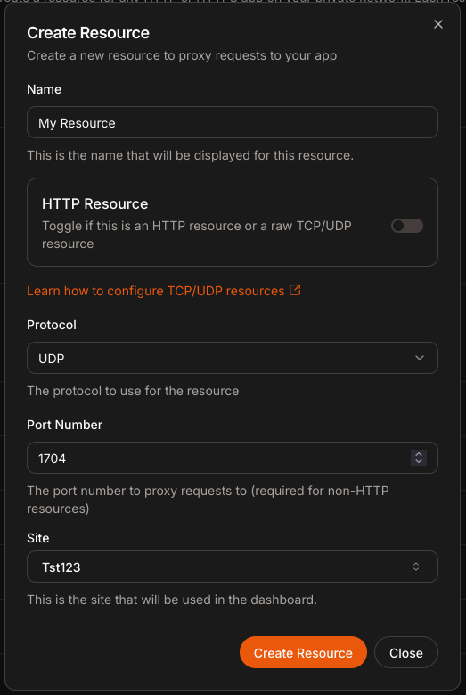

# TCP & UDP Support

:::warning

Before doing anything, make sure you've updated Newt to at least version 1.0.0-beta.5. Older versions of Newt will not work with TCP and UDP resources.

:::

Pangolin supports raw TCP and UDP traffic because under the hood Badger and Newt are just using basic WireGuard tunnels that can pass anything! There is a little manual setup you need to do before you can create a raw TCP or UDP resource:

### Video Demo

- ["Self-host a public Minecraft server without opening ports using Crafty and Pangolin" by Fossorial](https://youtu.be/acWB5wQQoOE?si=yONbB4o8r_gZqqU1&t=448)

## Configuring Firewall

This is highly OS and VPS dependent. Just in the same way you opened port 51280, 443, and 80, you need to open your desired port to your VPS so that Traefik can pass traffic out to the internet.

## Configuring Docker

If you are using the standard install with a Docker network you will need to expose your ports from the Gerbil Docker container as well. This can be done by simply adding a port mapping to the docker-compose.yml file you can find in the root where you installed Pangolin:

```yaml
gerbil:
  ...
    ports:
        - 51820:51820/udp # LEAVE ALONE: For Wireguard
        - 443:443 # LEAVE ALONE: For HTTPS
        - 80:80 # LEAVE ALONE: For HTTP

        - 1704:1704/udp # ADDED
        - 1602:1602 # ADDED
```

:::tip

After editing the Docker Compose config you need to restart it! You can do `sudo docker compose up -d`

:::

## Configuring Traefik

Once you have opened the port on your firewall you need to create an "EntryPoint" in Traefik. "EntryPoints are the network entry points into Traefik. They define the port which will receive the packets, and whether to listen for TCP or UDP. (Traefik Labs 2024)" Unfortunately this must be done manually because Traefik does not support pulling EntryPoints from dynamic config locations.

But this is pretty simple! All you need to do is edit your Traefik config in `config/traefik/traefik_config.yml` with your favorite editor and add a new entry to the `entryPoints` section.

So for example a UDP EntryPoint would look like:

```yaml
entryPoints:
    udp-1704:
        address: ":1704/udp"
```

And for TCP:

```yaml
entryPoints:
    tcp-1602:
        address: ":1602/tcp"
```

:::info

The _name_ if the EntryPoint is IMPORTANT because it must be referenced by the dynamic config. ALWAYS name your EntryPoint in the format `protocol-port` as shown in the examples!

:::

The whole thing would look something like this:

```yaml
entryPoints:
    web:
        address: ":80"
    websecure:
        address: ":443"
        http:
            tls:
                certResolver: letsencrypt
        transport:
            respondingTimeouts:
                readTimeout: 30m
    tcp-1602:
        address: ":1602/tcp"
    udp-1704:
        address: ":1704/udp"
```

:::tip

After editing the Traefik config you need to restart it! You can do `sudo docker compose restart traefik`

:::

## Create the Resource

Finally! Now after all of that config you can create the resource in Pangolin. You can simply create a new resource and toggle the HTTP switch off. This will allow you to enter the SAME point you configured above and the protocol.

<div align="center">
    
</div>

After you create the resource you can add targets just like any other resource!
